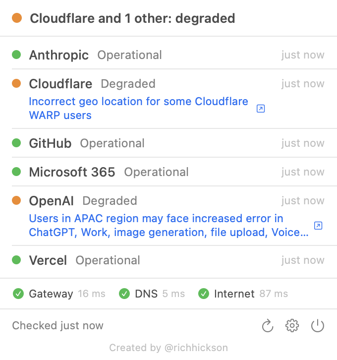

# StackStatus

<p align="center">
  
</p>

**Them, me, or the internet, answered from the menubar.**

StackStatus is a native macOS menubar app that watches the public status pages
of the SaaS and infrastructure vendors you depend on, runs its own lightweight
reachability probes alongside them, and tells you at a glance whether a problem
is the vendor, the internet, or your own connection. It notifies on incident
start and resolution only, runs entirely on your machine with no account and
no telemetry, and costs almost nothing in CPU, network or battery.

Built by [@richhickson](https://x.com/richhickson) at Helpfully IT. Sibling of
[Claude Usage](https://github.com/richhickson/claudecodeusage).

## Them, me, or the internet

Every vendor row combines three signals:

- **Feed**: what the vendor's own status page says.
- **Probe**: whether the service itself answers (an HTTPS HEAD, a TCP connect,
  or a DNS lookup that you configure per vendor).
- **Baseline**: three always on checks that are not tied to any vendor: your
  default gateway, DNS resolution of a known good name, and an HTTPS request
  to a known good page.

The combination gives the verdict:

| Vendor feed | Vendor probe | Baseline | Verdict shown |
|---|---|---|---|
| incident | any | ok | Vendor incident |
| ok | fail | ok | Looks like a vendor problem they have not posted yet |
| ok | fail | fail | Your connection |
| ok | ok | ok | All good |
| unreachable | any | fail | Your connection |

The menubar circle is green when everything is normal, amber for degraded
service or maintenance, red for a partial or major outage, and grey before the
first poll or while your own connection is down. Pull the network cable and
the verdict says "Your connection looks down" within two polls, and no vendor
is shown as down.

## Installation

Requires macOS 14 Sonoma or later, Apple Silicon or Intel.

**Download**: grab `StackStatus.zip` from the
[latest release](https://github.com/richhickson/StackStatus/releases/latest),
unzip, and drag `StackStatus.app` to Applications. It is signed with Developer
ID and notarised, so it opens without Gatekeeper complaints.

**Homebrew**: the cask lives in this repository until it is accepted into a tap:

```sh
brew install --cask https://raw.githubusercontent.com/richhickson/StackStatus/main/Casks/stackstatus.rb
```

**Build from source**:

```sh
git clone https://github.com/richhickson/StackStatus.git
cd StackStatus
open StackStatus.xcodeproj
```

Then build and run in Xcode. The project is generated with
[XcodeGen](https://github.com/yonaskolb/XcodeGen) from `project.yml`; run
`xcodegen generate` after adding files.

## What it watches

Supported status page platforms:

| Platform | How | Fidelity |
|---|---|---|
| Atlassian Statuspage | `/api/v2/status.json`, then the unresolved incidents only when needed | Full: state, incident title and link, maintenance |
| incident.io | `/api/v1/summary`, with the page's own `/proxy/<host>` document as fallback | Full: state from affected components, incident title and link |
| RSS or Atom feed | Any feed; a recent unresolved item counts as an incident | Degraded: shows as "degraded", no severity |

Bundled vendors, verified against the live endpoints:

| Vendor | Platform | Probes |
|---|---|---|
| Anthropic | Statuspage at status.claude.com | HEAD api.anthropic.com |
| Cloudflare | Statuspage | HEAD 1.1.1.1, DNS cloudflare.com via 1.1.1.1 |
| GitHub | Statuspage | HEAD api.github.com, TCP github.com:22 |
| Microsoft 365 | Feed (admin center RSS) | HEAD outlook.office365.com, HEAD login.microsoftonline.com |
| OpenAI | incident.io | HEAD api.openai.com |
| Vercel | Statuspage | HEAD api.vercel.com, DNS vercel.com |

Microsoft publishes no anonymous JSON for tenant service health, so the
bundled entry watches the admin center feed at
`status.cloud.microsoft/api/feed/mac`. By Microsoft's own description that
feed only updates when an issue stops administrators reaching Service health,
so it catches the big outages and not every small one. The probes fill the
gap. Details in [docs/ARCHITECTURE.md](docs/ARCHITECTURE.md).

## Adding a vendor

In the app: Settings, Vendors, Add vendor. Paste the status page URL and press
Detect. It tries incident.io, then Atlassian Statuspage, then the common feed
paths, then any feed the page advertises in its HTML.

By hand: vendors are stored as JSON in the app's container at
`~/Library/Containers/com.helpfullyit.stackstatus/Data/Library/Application Support/StackStatus/vendors.json`
(the app is sandboxed, so that is where Application Support lives).
Settings, Vendors, Reveal vendors.json opens it in Finder. The schema:

```json
{
  "version": 1,
  "vendors": [
    {
      "id": "cloudflare",
      "name": "Cloudflare",
      "enabled": true,
      "platform": "statuspage",
      "baseURL": "https://www.cloudflarestatus.com",
      "incidentURL": "https://www.cloudflarestatus.com",
      "probes": [
        { "type": "https_head", "url": "https://1.1.1.1/" },
        { "type": "dns", "host": "cloudflare.com", "resolver": "1.1.1.1" }
      ]
    }
  ]
}
```

`platform` is `statuspage`, `incidentio` or `feed`. Feed vendors also need a
`feedURL`. Probe types are `https_head` (any response below 500 passes, so a
401 from an API host still proves it is up), `tcp` (`host` and `port`) and
`dns` (`host`, optional `resolver`).

To share a vendor with everyone, add one file to the
[`vendors/`](vendors/) directory and open a pull request. Every file there is
merged into the bundled default list at build time. See
[CONTRIBUTING.md](CONTRIBUTING.md).

## Notifications

StackStatus notifies on transitions, never on every poll:

- A vendor goes from operational to anything worse: one notification with
  the vendor, the new state and the incident title. A state has to be seen on
  two consecutive polls before it counts, except a major outage, which is
  immediate.
- A vendor returns to operational: one "resolved" notification with how long
  it lasted.
- An incident escalates (say degraded to major outage): one notification.
- Your baseline checks fail on two consecutive polls: one "your connection
  looks down" notification. A single failed poll is never reported.

Quiet hours silence notifications between two times of day while the icon
keeps updating. A timed out status page shows as unknown, never as an outage.

## Load and energy

These are design requirements, not aspirations.

- All fetches in a poll cycle run as one concurrent burst, so the radio wakes
  once per cycle.
- Every feed request is conditional (`If-None-Match`). A `304 Not Modified`
  costs a few hundred bytes and changes nothing on screen.
- Only the tiny `status.json` is polled on Statuspage vendors. The incident
  list is fetched only when the indicator says something is wrong.
- Interval: your setting (2, 5, 10 or 15 minutes, default 5) when everything
  is green; 2 minutes while any vendor has an incident; three times your
  setting on battery when nothing is wrong; paused while the Mac sleeps, with
  one poll straight after wake.
- Timeouts: 10 seconds per request, 15 seconds for the whole cycle.
- `Retry-After` is honoured and repeated 429 or 5xx responses from a status
  page back off exponentially, capped at 30 minutes.

Measured with five bundled vendors at the 5 minute default on a MacBook
Pro with Apple Silicon, using `Scripts/measure.sh` (ten minutes, then scaled):

| Measure | Result |
|---|---|
| Network per day | 115 KB in ten minutes while Cloudflare had an open incident, so at the 2 minute incident interval. That is 16.5 MB a day if an incident ran all day, and about 6 MB a day at the 5 minute interval. Most of it is TLS handshakes for the probes, not status data. |
| CPU at idle (Activity Monitor) | 0.0% (0.05% averaged over 60 samples with `ps`) |
| Memory | 17 MB physical footprint (Activity Monitor's Memory column); 48 MB resident set including shared system frameworks |
| Energy impact (Activity Monitor) | Low |

Reproduce: build the app, then run

```sh
Scripts/measure.sh build/export/StackStatus.app 600
```

It launches the app, waits ten minutes, and prints the bytes transferred per
`nettop`, the average CPU per `ps`, and resident memory. You can also run one
poll cycle from a terminal and see exactly what the app sees:

```sh
StackStatus.app/Contents/MacOS/StackStatus --once
```

## Privacy

- Nothing leaves your machine except `GET` and `HEAD` requests to the status
  pages and probe targets you configure. The app never sends a `POST`.
- The User-Agent is `StackStatus/<version> (+https://github.com/richhickson/StackStatus)`
  so vendors can see who is asking.
- No cookies, no URL cache, no analytics, no crash reporting, no update pings.
- No account. Your vendor list is a JSON file on your disk and nowhere else.
- App Sandbox is on with only the outgoing network entitlement.

Vendor status APIs are public but undocumented and may change without notice.
When one does, the vendor shows as unknown rather than as down, and a fix is a
pull request away.

## Contributing

Vendor definitions are the most useful contribution: one JSON file in
[`vendors/`](vendors/), validated by `Scripts/merge-vendors.sh`, and a pull
request that says which platform you found. Code changes need
`xcodebuild test` green; CI runs it on every push. See
[CONTRIBUTING.md](CONTRIBUTING.md) for the vendor process and for
`Scripts/fixture-server.py`, a fake status page for testing notifications end
to end.

## Licence

MIT. See [LICENSE](LICENSE).

---

Created by [@richhickson](https://x.com/richhickson)
